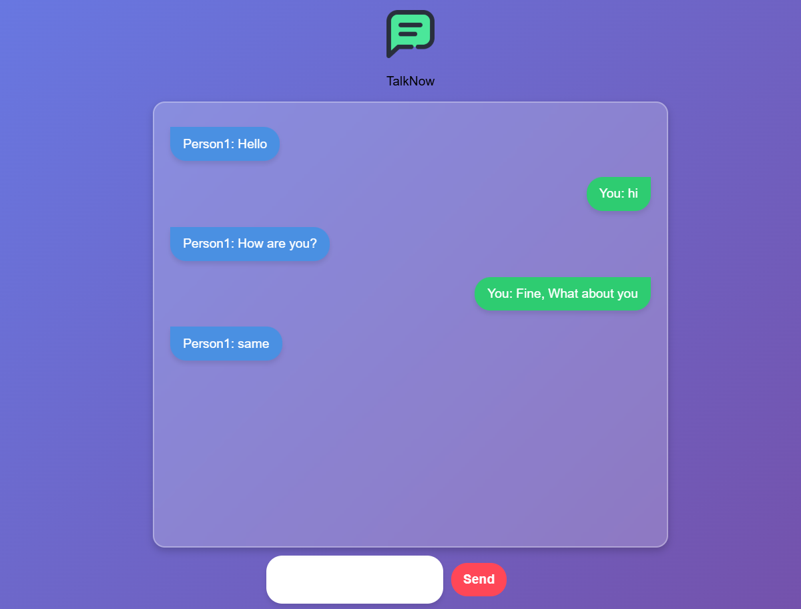

# TalkNow - Real-Time Chat App 💬🚀  

TalkNow is a **real-time chat application** built with **Node.js, Socket.io, HTML, CSS, and JavaScript**. It allows multiple users to join a chatroom and communicate instantly with a clean and responsive UI.

## 🚀 Features  
✅ Real-time messaging using **WebSockets**  
✅ User **join/leave notifications**  
✅ Audio alerts for new messages 🔔  
✅ **Responsive UI** with alternating left-right messages  
✅ Built with **Socket.io & Node.js**  

---

## 🛠️ Tech Stack  
- **Frontend:** HTML, CSS, JavaScript  
- **Backend:** Node.js, Express, Socket.io  
- **Real-Time Communication:** WebSockets via Socket.io  

---

## 📌 Installation & Setup  

### **1️⃣ Install Dependencies**  
Run the following command to install `socket.io`:  
```bash
npm install socket.io
```
### 2️⃣ Start the Server
Run the following command to start the server:
```bash
npm run dev
```
---
### **3️⃣ Open `index.html` in a Browser**  
To run the frontend, use **Live Server** in VS Code:  

1. Install the **Live Server** extension in VS Code (if not installed).  
2. Open `index.html` in VS Code.  
3. Right-click `index.html` and select **"Open with Live Server"**.  
4. Live Server will open the app at `http://localhost:5500`.  
5. **Note:** Live Server will work **only if the backend server is running** (`npm run dev`).
--- 


